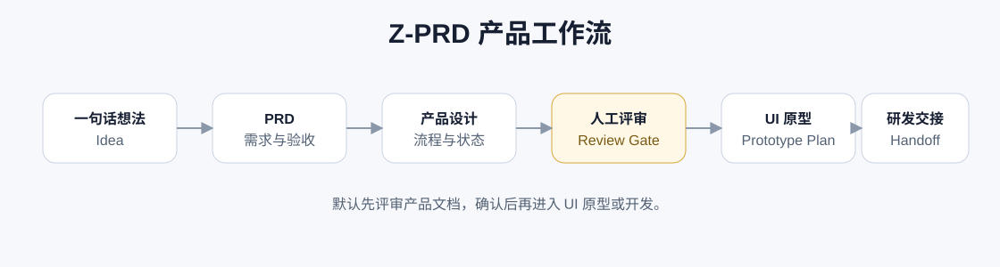

# Z-PRD



`Z-PRD` 是一个中文优先的 Codex 产品工作流 Skill。它把一句话想法、模糊需求、业务请求、App/网站/小程序概念，推进成可评审的 PRD、产品设计、UI 原型计划和研发交接材料。

它不是普通提示词包，也不是把产品经理拆成一堆互相竞争的入口。`Z-PRD` 只暴露一个主 Skill：`$z-prd`。主入口负责判断当前阶段，必要时再按“需求分析 / 产品设计 / UI 原型 / 研发交接”的专家视角组织输出，从而减少误触发和上下文浪费。

## 适合谁

- 产品经理：把零散想法变成能评审、能交接、能开发的产品文档。
- 创业者和业务负责人：把一句话需求推进到 MVP 范围和可验证路径。
- 设计师和运营：先确认页面结构、状态和用户流程，再进入 UI 原型。
- 开发者和 vibe coding 用户：在写代码前补齐 PRD、验收标准和交接信息。

## 解决什么问题

| 常见问题 | Z-PRD 的处理方式 |
| --- | --- |
| AI 一上来就写代码 | 默认先产出产品文档，并在评审点暂停 |
| 需求文档太空泛 | 输出 P0/P1/P2、用户故事、验收标准、边界和风险 |
| 页面设计和需求脱节 | 从 PRD 推导信息架构、页面地图、核心流程和状态 |
| 原型缺少真实业务状态 | 明确空状态、加载、错误、权限、异常和样例数据 |
| 多个产品 Skill 同时触发 | 只保留 `$z-prd` 一个入口，细节按需加载 |
| 上下文太贵 | 主 Skill 保持精简，长模板和路由规则放入 `references/` |

## 快速开始

复制 `skills/z-prd` 到 Codex 技能目录：

```text
C:\Users\<you>\.codex\skills\z-prd
```

重启 Codex 或打开新线程后使用：

```text
Use $z-prd 帮我把“做一个面向独立开发者的需求到原型工具”整理成产品方案。
```

中文也可以直接说：

```text
用 $z-prd 帮我从一句话需求到 PRD、产品设计和 UI 原型计划。
```

## 默认流程


默认会在产品文档阶段暂停，等你确认后再进入 UI 原型或开发。只有当你明确说“无需审核”“直接跑完”“不要停”时，才会跳过评审点。

产品文档确认后，`Z-PRD` 还会再问一次是否继续输出设计落地材料。不继续就停在当前成果，避免为了“看起来完整”而浪费上下文。

## 输出内容

评审点通常包含：

- 产品理解、目标用户和核心场景
- P0/P1/P2 需求列表
- 用户故事和验收标准
- MVP 边界和暂不做内容
- 信息架构、页面地图和核心流程
- 关键状态、异常、权限和边界情况
- 样例数据、UI 原型计划和研发交接要点
- 假设、风险、开放问题和推荐下一步

完整模板见 [`skills/z-prd/references/product-flow-template.md`](skills/z-prd/references/product-flow-template.md)。

## 多 Agent 与 Token 策略

`Z-PRD` 默认由主 agent 完成，只有任务足够复杂时才建议拆分视角：

- 需求分析视角：需求模糊、验收标准不足、优先级不清。
- 产品设计视角：对象、权限、页面流、状态和 MVP 需要重新建模。
- UI 原型视角：需要把产品文档转成可运行或可评审界面。
- 研发交接视角：需要拆数据对象、接口动作、验收检查和实现风险。

详细规则见：

- [`multi-agent-routing.md`](skills/z-prd/references/multi-agent-routing.md)
- [`token-budget-guide.md`](skills/z-prd/references/token-budget-guide.md)

## 设计落地输出

产品方案被认可后，后续设计输出不是必选项。`Z-PRD` 会先询问是否继续：

| 选择 | 适合场景 | 输出 |
| --- | --- | --- |
| 不继续 | 当前 PRD/产品设计已经够用 | 阶段总结、下一步建议 |
| 低保真 | 还要先确认结构和流程 | 页面清单、用户流程、线框说明、状态矩阵 |
| 设计交付包 | 设计师或协作平台继续落地 | 页面规格、组件、文案、样例数据、设计 token |
| 平台协作 | 团队使用墨刀、蓝湖、Figma、MasterGo、Pixso 等工具 | 上传清单、标注说明、交互说明、资产清单 |
| 可运行原型 | 需要评审或开发复刻 | HTML/React 原型、响应式检查、视觉验证 |

如果用户已经登录墨刀、蓝湖等平台，并明确要求上传，`Z-PRD` 可以协助整理上传材料并通过浏览器操作上传；上传前会确认目标空间、文件内容和外部提交动作。

设计输出规则见 [`design-output-options.md`](skills/z-prd/references/design-output-options.md)。

## 与热门项目的关系

`Z-PRD` 借鉴了热门 PM skill 项目的优点，但刻意保持轻量：

- 不做 60+ skill 的大而全库，避免安装后触发混乱。
- 不把所有方法论塞进主入口，避免每次加载都烧 token。
- 不追求覆盖整个 PM OS，而是专注“想法 -> PRD -> 产品设计 -> 原型计划 -> 研发交接”这条高频链路。

对比分析见 [`docs/comparison.md`](docs/comparison.md)。

## 仓库结构

```text
repo-root/
├── README.md
├── assets/
│   └── workflow.svg
├── docs/
│   ├── comparison.md
│   └── usage-cn.md
└── skills/
    └── z-prd/
        ├── SKILL.md
        ├── agents/
        │   └── openai.yaml
        └── references/
            ├── multi-agent-routing.md
            ├── product-flow-template.md
            ├── token-budget-guide.md
            └── design-output-options.md
```

## 设计原则

- 一个入口：用户只需要记住 `$z-prd`。
- 中文优先：默认用中文输出，除非用户要求英文。
- 先产品后实现：默认先评审产品文档，再进入原型或代码。
- 轻量加载：主 Skill 精简，长模板按需读取。
- 可交接：每份输出都应该能被 UI、研发或下一轮 agent 接住。
